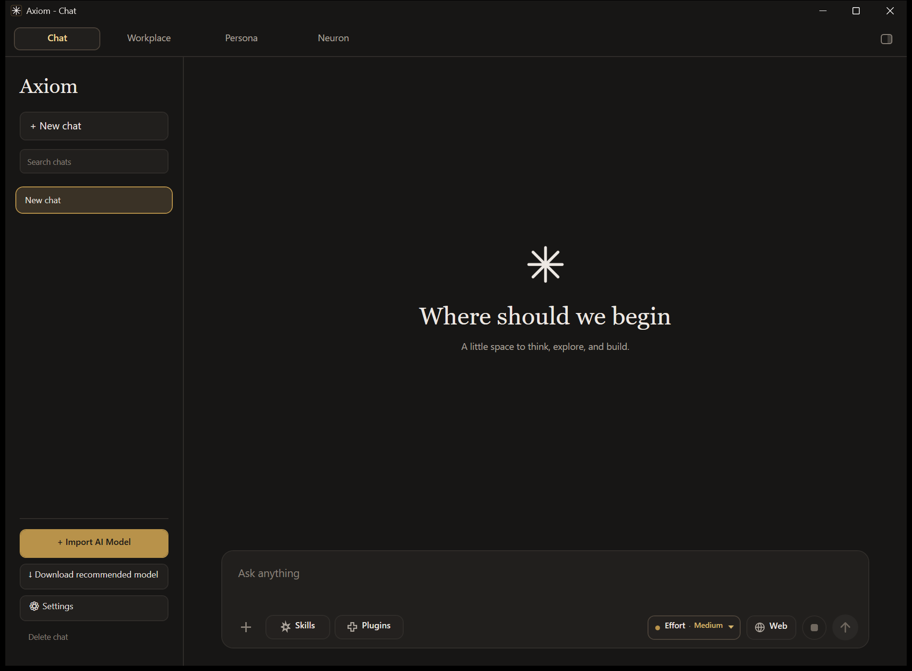
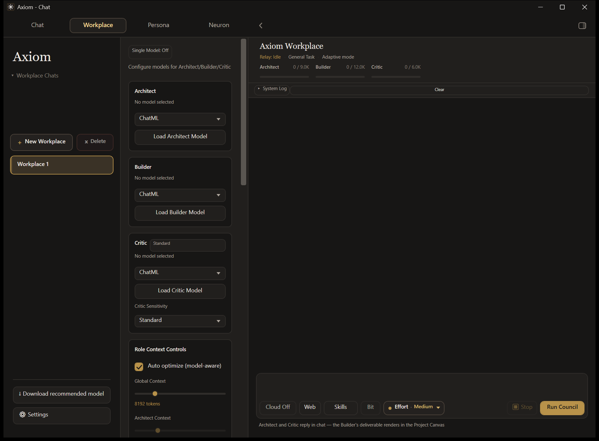
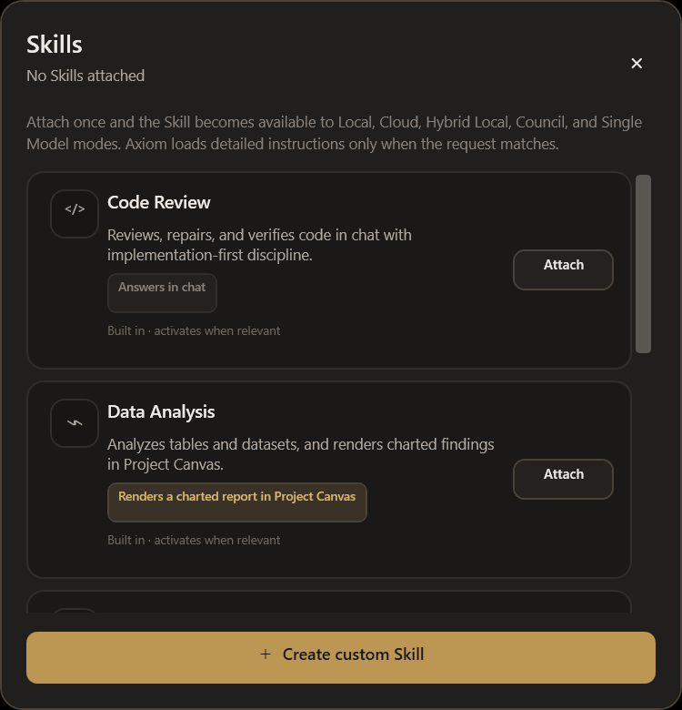
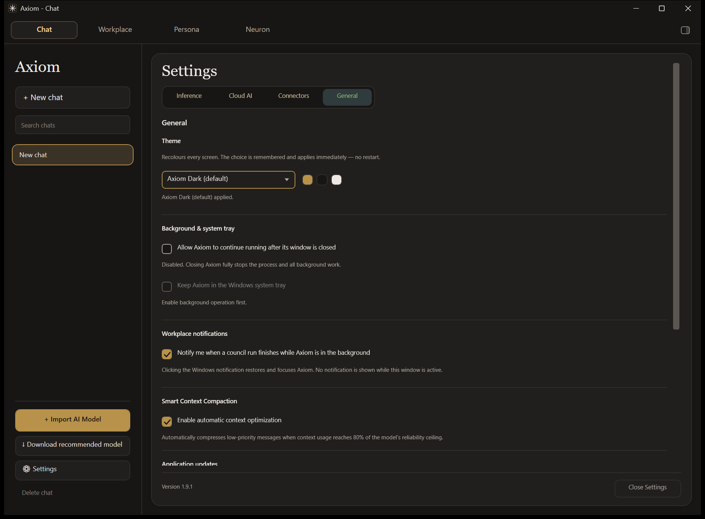
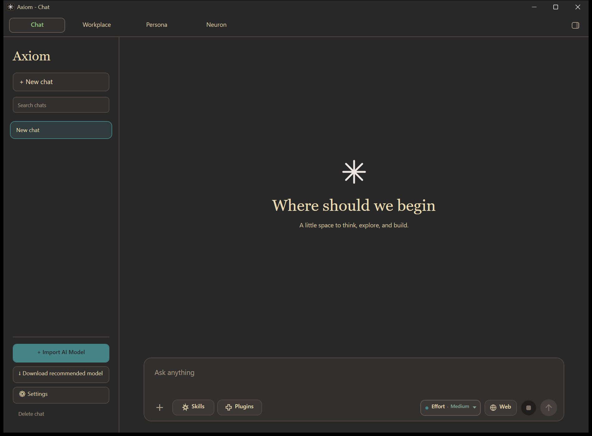
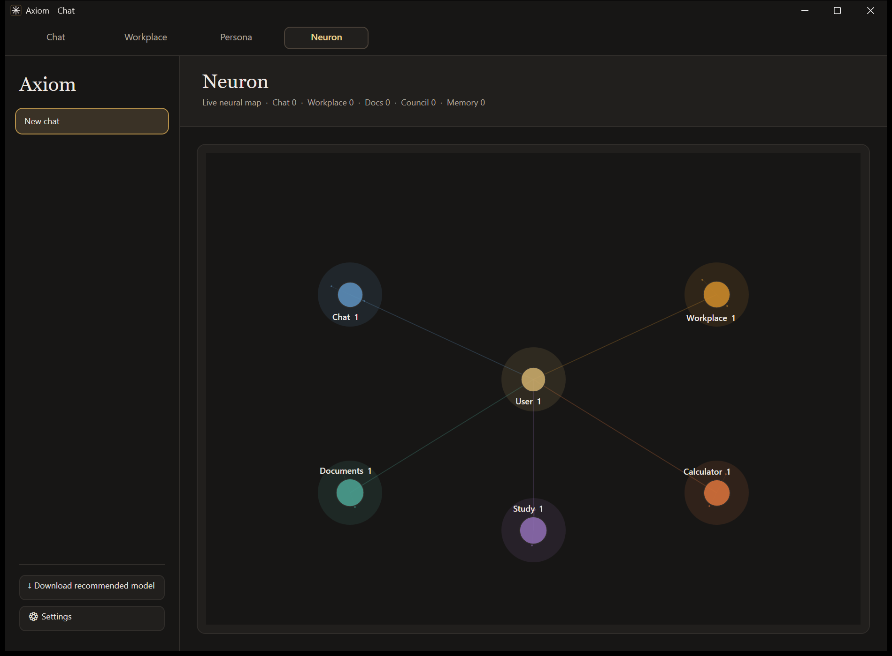

<div align="center">

# Axiom

**A free, local-first AI assistant and agentic workspace for Windows.**

Run GGUF models on your own hardware, point Axiom at a self-hosted endpoint, or use
cloud models with your own key. Your chats, models, and data stay on your computer
unless you deliberately reach out to a cloud model or a connected service.


[Download](../../releases) · [Getting started](#getting-started) · [Feedback](#feedback)

</div>



---

## Three ways to run a model

Axiom treats all three as first-class. Attachments, Skills, tools, Project Canvas, and
memory behave the same way regardless of which one is selected.

| | Runs on | You need | Good for |
|---|---|---|---|
| **Local** | Your GPU/CPU via llama.cpp | A GGUF model | Full privacy, offline work, no per-token cost |
| **Hybrid Local** | Your own server | An OpenAI-compatible endpoint | Your own hardware, accessed from anywhere |
| **Cloud** | OpenRouter | Your own API key | Frontier-class models when you want them |

Axiom adapts to the model it is given. It measures a local model's parameter count and
scales context budgets, tool routing, and prompt complexity accordingly — so a 0.5B
model and a 70B model both produce usable results instead of the small one collapsing.

---

## Chat

The everyday surface: one conversation, one model, every tool available.

- **Attachments with previews** — drop in documents, spreadsheets, presentations,
  e-books, notebooks, source code, subtitles, or images and see a thumbnail of each one
  above the composer before you send.
- **Positional references** — say *"in the 3rd attached image"* or *"the first PDF"* and
  Axiom resolves which attachment you mean, on every model size.
- **Tools** — Python sandbox, calculator, web search, and Java execution, exposed
  according to the selected mode.
- **Project Canvas** — type `@ProjectCanvas` to render the answer as a live artifact in
  a resizable side pane: HTML, SVG, Markdown, or interactive JavaScript.
- **Effort control** — dial reasoning, generation, and tool budgets up or down per turn.
- Markdown and LaTeX that stay stable while you scroll, plus local chat history, persona
  memory, and document retrieval.

## Workplace

A multi-agent workspace for work that takes more than one pass.



**Council mode** runs three roles in sequence:

1. **Architect** plans the task.
2. **Builder** produces the deliverable.
3. **Critic** reviews it and can send it back for a targeted revision.

**Single Model mode** collapses those handoffs into one agent that plans, uses tools,
executes, and verifies its own result. Switch between them from the Workplace header
whenever a run isn't active.

Also in Workplace: persistent sessions, study and document preprocessing, task history,
per-role context controls, live activity, completion notifications, and the Project Canvas
the Builder writes into.

### Files in Project Canvas

Put `@ProjectCanvas` in a Workplace prompt and ask for a file — *"make me a requirements.txt"*,
*"a docker-compose.yml"*, *"the results as a csv"* — and it is presented in the canvas under its
real name, with the pane opening on its own. Save offers that filename too.

Any text format works: `.md`, `.txt`, `.csv`, `.json`, `.yaml`, `.sql`, source code, and so on.
CSV renders as a table, Markdown renders, HTML and SVG keep their visual preview, and everything
else gets a monospace view. Images and other binary formats are refused with an explanation
rather than failing quietly.

## Computer Use

Type `@ComputerUse` followed by a goal in the Workplace composer and Axiom will drive the
desktop directly — screen capture, planning, mouse and keyboard, and verification that
the action actually landed.

```
@ComputerUse open Notepad and type hello
```

It needs a **vision-capable model** (a cloud vision model, or a local GGUF with a
projector). Axiom probes the active model first and tells you plainly why a run can't
start rather than failing halfway through. Sessions run in a dedicated window with a
visible pointer overlay, an action log, and safety checks on navigation and target
selection.

## Computer Agent

Turn it on in the Workplace sidebar and the model operates your machine the way a terminal
coding agent does — running commands, reading and writing files, searching the disk — then
answers from what it actually found.

It has seven tools: `run_command`, `read_file`, `write_file`, `edit_file`, `list_directory`,
`find_files`, and `search_text`.

**You choose how much rope it gets:**

| Mode | Behaviour |
|---|---|
| **Manual** | Stops before every command and file change. An approval bar offers Approve, Always allow this, or Deny. |
| **Auto** | Runs without stopping to ask. |

**And how far it can reach** — a folder you pick, or the entire computer. Whole-computer scope
and Auto mode each need an explicit confirmation before they turn on.

Works on Local, Hybrid Local, and Cloud. Capable models get JSON tool calls and a long step
budget; sub-4B models get a flat text protocol they can actually produce, with a shorter budget
and trimmed tool output, so the feature still works on a small local model.

**What it refuses, in both modes:** formatting a drive, repartitioning, deleting a drive root,
rewriting the boot configuration, wiping free space, shutting the machine down, and writing into
Windows system folders. The patterns are narrow — `rm -rf ./build` and `git reset --hard` run
normally.

While a step is in flight, a quiet line above the composer names it ("Ran dotnet build",
"Read App.xaml"), and clears when the run finishes.

## Skills

Skills are reusable procedures you attach once. They apply everywhere — Local, Cloud,
Hybrid Local, Council, and Single Model — instead of being tied to one chat.



The important part is what a Skill *delivers*. Some answer in chat. Others produce a
rendered artifact in Project Canvas:

| Skill | Delivers |
|---|---|
| **Slide Deck Studio** | A navigable slide deck — 16:9 stages, arrow-key navigation, speaker notes |
| **PDF Studio** | A print-ready document with a proper `@media print` layout |
| **Data Analysis** | A charted report with inline SVG charts and the figures beneath them |
| **Document Summarizer** | A traceable summary in chat |
| **Code Review** | A review in chat |

Ask for a slide deck with Slide Deck Studio attached and you get an actual deck, not a
description of one — no `@ProjectCanvas` needed.

**This works on small models too.** A sub-4B model can't author a correct self-contained
HTML document, so Axiom doesn't ask it to. Below that threshold the model supplies a short
structured outline and *Axiom builds the artifact itself*. Above it, the model authors the
artifact directly. Either way the deliverable is the same.

You can also write your own Skills — a name, a procedure, activation terms, and whether it
renders or answers in chat. Custom Skills are instructions, not scripts; they never
execute arbitrary code.

## Plugins

Plugins package capabilities Axiom already has, so a model uses them consistently:
**Web Research**, **Data Lab**, **File Intelligence**, **Connected Apps**, and
**Creator Studio**.

A Plugin never grants a capability the current model or host doesn't actually expose.
Connected Apps uses only the MCP connectors you configured in Settings.

## Themes

Settings → General switches the whole app between themes. The change applies instantly —
no restart — and is remembered.

<table>
<tr>
<td width="50%"></td>
<td width="50%"></td>
</tr>
<tr>
<td align="center"><em>Axiom Dark (default)</em></td>
<td align="center"><em>Gruvbox Dark</em></td>
</tr>
</table>

Theming reaches every surface: both chats, dialogs, the Effort picker, rendered chat
bubbles, and the native Windows title bar.

## Neuron

A live map of what Axiom is doing — active sessions, tool usage, and activity across
Chat, Workplace, Documents, Study, and Calculator.



---

## Models

Local mode accepts any compatible GGUF and can install one for you. Cloud mode uses
OpenRouter with your own key.

| Axiom profile | Model | Intended use |
|---|---|---|
| **Edios 1.5** | Google Gemma 4 31B (free) | General chat, reasoning, documents, tool use |
| **Hepha 2.5 Coder** | NVIDIA Nemotron 3 Ultra (free) | Repository-aware coding |
| **Workplace cloud default** | Poolside Laguna M.1 (free) | Council and Single Model runs |
| **Kestral 1** | Your self-hosted endpoint | Hybrid Local inference |

Cloud availability and routing depend on OpenRouter and its providers. Axiom reports
exhausted keys and rate limits directly instead of dressing them up as answers.

## Tools, memory, and privacy

| | |
|---|---|
| **Calculator** | Scientific expressions and unit conversions |
| **Python sandbox** | Persistent session, bounded execution, chart capture |
| **Java sandbox** | Compile and run Java for supported Workplace tasks |
| **Web search** | Multi-source querying, deduplication, trust scoring, synthesis |
| **Codebase access** | Inspect and patch an explicitly connected workspace, with validation |
| **Session memory** | In-session episodic context for Workplace roles and study sessions |
| **Persona memory** | Persistent preferences stored locally |
| **Context compaction** | Keeps important requirements intact as conversations grow |

Your data lives in `%LOCALAPPDATA%\Axiom`; debug runs use a separate `%LOCALAPPDATA%\Axiom-Dev`
profile. Chats, API keys, connector tokens, local models, and Workplace sessions are never
placed inside release packages.

## Background and system tray

Settings has separate switches for background operation and the system tray. With both on,
closing the window hides Axiom in the tray instead of ending work in progress; Axiom stops
UI activity while hidden and releases heavy model caches once work finishes. **Exit Axiom**
in the tray menu stops the process completely. With either switch off, closing the window
exits normally.

---

## Getting started

1. Download the latest Windows ZIP from [Releases](../../releases).
2. Extract the **whole folder** — don't run the executable from inside the ZIP.
3. Launch `Malx_AI.exe`.
4. Import or install a GGUF model, configure Hybrid Local, or add an OpenRouter key.
5. Open Chat, or head to Workplace.

## Updating

V1.7.0 and newer check the stable GitHub Releases feed at startup. Use the in-app
notification or **Settings → General → Check for updates**. Axiom downloads and verifies
the package, stages it outside the install directory, replaces only package-managed files
after shutdown, and restarts in place. Obsolete files, backups, and staging folders are
cleaned up afterwards.

Settings, chats, local models, connectors, and Workplace data are left untouched. Manual
ZIP installation still works for first-time setup and recovery.

Set `AXIOM_UPDATE_DIR` to an absolute path to stage downloads outside `%LOCALAPPDATA%`.
Maintainers: see [RELEASING.md](RELEASING.md) — update ZIPs need a matching version tag,
packaged executable version, and `AXIOM_UPDATE_MANIFEST.txt`.

## System requirements

| | |
|---|---|
| **OS** | Windows 10 or 11 (64-bit) |
| **RAM** | 4 GB minimum; 16 GB recommended for local models |
| **CPU** | Modern x64 |
| **GPU** | Optional NVIDIA CUDA acceleration |
| **Runtime** | Self-contained release; .NET 10 SDK only for development |

## Built with

C# · WPF · .NET 10 · LLamaSharp / llama.cpp (CUDA 12) · Python.Included · Markdig · KaTeX ·
HtmlAgilityPack · AvalonEdit · UglyToad.PdfPig · SQLite · WebView2

---

## Feedback

I'd love to hear from you. Bug, feature request, or just how it's going — reach me at
**malxshrouds@gmail.com**. Your input genuinely shapes what gets built next.

## License

CC BY-NC-ND 4.0 — see [LICENSE](LICENSE).

The source is publicly viewable, but it may not be redistributed, modified, or used
commercially without explicit permission from the author.

## Author

Built by [YoMosa2009](https://github.com/YoMosa2009)

[MalxLabs.work](https://malxlabs.work) · [MalxInference.work](https://malxinference.work/) · [Axiominference.work](https://axiominference.work/)
